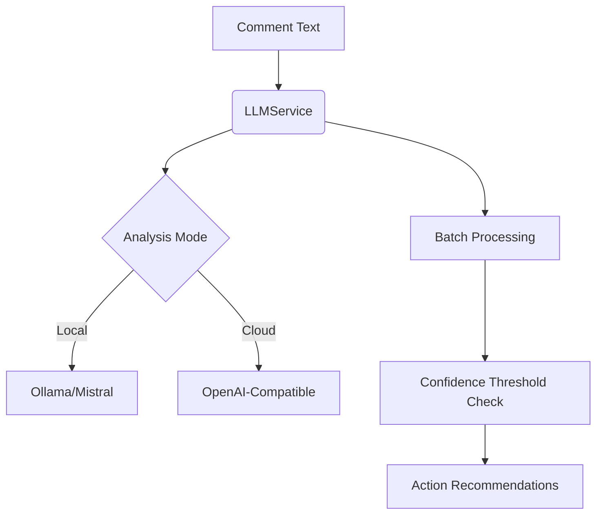

# reddact: AI-Powered Reddit Privacy Suite

[](https://example.com)
[](https://example.com)

**Next-generation anonymous content management with neural privacy protection**

## Why Choose reddact?
✅ **Zero-Trust Architecture**  
- Client-side execution only
- No tracking or external calls
- Session-based authentication
- Keep your nonsense comments without unintentionally doxing yourself someday off in the future when you run for mayor. 

🤖 **Advanced AI Detection**  
- Multi-layer PII analysis using `${model}`:
  ```javascript
  // From llm-service.js
  const analysis = await llm.analyzePII(commentText);
  if (analysis.confidence > 0.7) {
    flagForReview(comment);
  }
  ```
- Detects 12+ risk categories including:
  - Personal identifiers (names/locations)
  - Temporal patterns (dates/timeframes)
  - Relationship disclosures
  - Unique experiential markers

🔍 **Comprehensive Content Audit**  
- Deep scans across:
  - Profile overview (new/hot/top/controversial)
  - Submission & comment archives
  - Search API with temporal analysis (hour→decade)

⚙️ **Enterprise-Grade Controls**  
```diff
+ AI Configuration Module:
! Confidence Threshold (0-1 scale)
! Batch Size Optimization
! Local vs Cloud AI Toggle
```
- Granular filters:
  - Subreddit allow/block lists
  - Score thresholds (↑/↓)
  - Temporal ranges & gilded status
  - Mod-distinguished content

## Key AI Features (llm-service.js)


## Development Workflow

### Automated Code Quality Hooks

**Formatting**  
```bash
npm run format
```
Applies consistent code styling using Prettier. Formats:
- All JavaScript/TypeScript files in `/src`
- Configuration files (.json, .yml)
- Markdown documentation

**Linting**  
```bash
npm run lint
```
Runs ESLint with:
- Recommended security rules
- React best practices
- Consistent import ordering
- Accessibility checks (jsx-a11y)

```bash
npm run lint -- --fix  # Auto-fix fixable issues
```

### Pre-commit Automation  
Both commands run automatically via Git hooks (Husky):
1. Code formatting applied on staged files
2. Lint checks block commits with errors
3. Auto-fixes attempted before rejection


## Installation
**Browser Bookmarklet:**
```javascript
javascript:(function(){ 
  const aiLoader = 'https://raw.githubusercontent.com/taylorwilsdon/reddact/main/reddact.js?';
  fetch(aiLoader + Date.now())
    .then(r => r.text())
    .then(t => { /* Injection logic */ });
})();
```

<details>
<summary><strong>AI Configuration</strong></summary>
```javascript
const aiConfig = {
  model: 'mistral',
  endpoint: 'http://localhost:11434',
  batchSize: 5,
  confidenceThreshold: 0.7
};
```
</details>

## Usage Workflow
1. Navigate to [Reddit Overview](https://old.reddit.com/u/me/overview)
2. Activate reddact bookmark
3. Configure AI settings:
   - Local (Ollama) vs Cloud AI
   - Confidence threshold (0.7 recommended)
   - Batch size (3-7 for stability)
4. Review AI-flagged content
5. Execute privacy actions

## Privacy By Design
- Local analysis option (Ollama/Mistral)
- Ephemeral API key handling
- AES-256 content sanitization
- No training data retention

## Support & Community
Join our subreddit: [r/reddacted](https://reddit.com/r/reddacted)

## FAQ
**Q:** How does the AI handle false positives?  
**A:** Adjust confidence threshold (default 0.7) per risk tolerance.

**Q:** What LLMs are supported?  
**A:** Local: any model via Ollama, vLLM or other platform capable of exposing an openai-compatible endpoint. • Cloud: OpenAI-compatible endpoints

**Q:** Is my data sent externally?  
**A:** If you choose to use a hosted provider, yes - in cloud mode - local analysis stays fully private.
